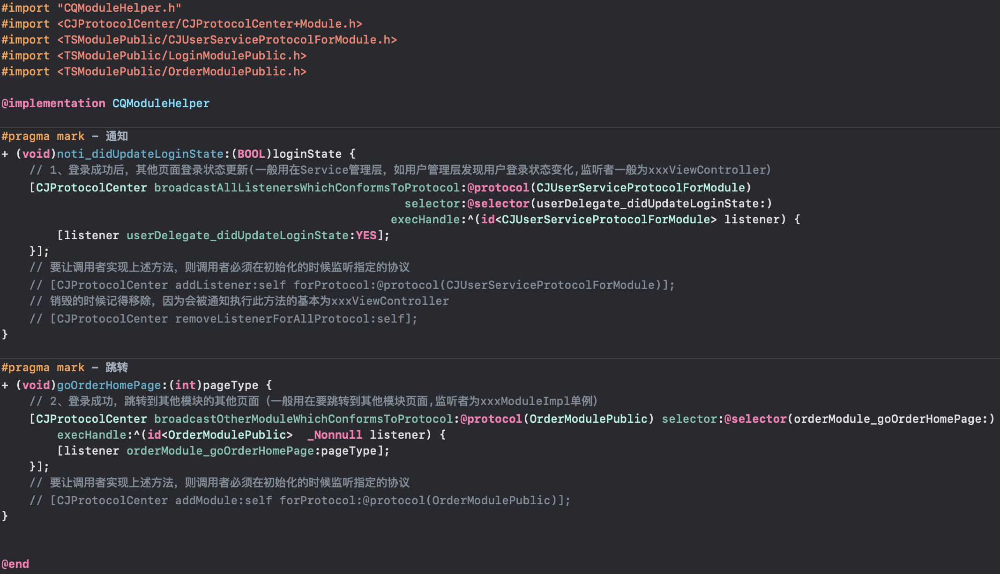
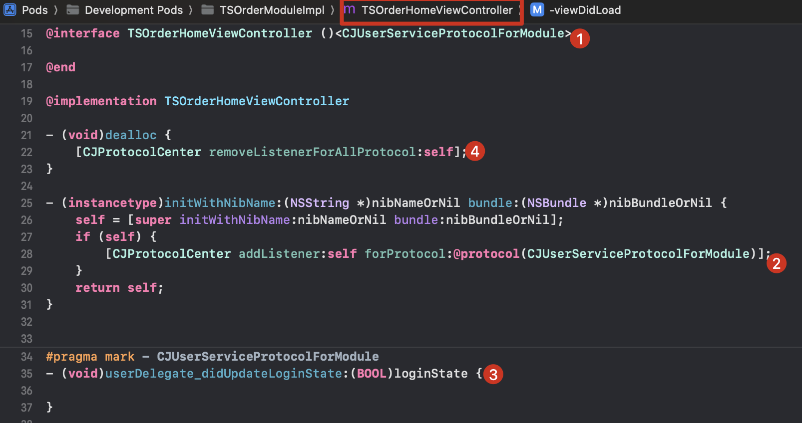
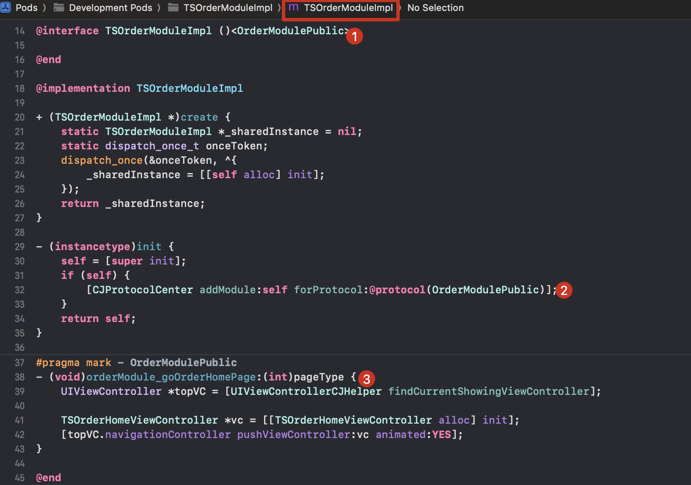

# 033-Data-Notification-iOS
数据之通知(iOS添加多代理模式发送数据)


## 一、支持的功能

**1、A模块中调用B模块中的方法 / A模块让B执行某个方法**

**2、a业务通知所有b业务更新(a、b业务可在不同模块）**


## 二、项目中的使用举例

以登录成功为例，后续需要执行以下事件

①其他页面登录状态更新

②跳转到其他模块的其他页面

### 实现步骤1：发起事件

```objc
// LoginViewController.m
- (void)__loginSuccess {
    // 1、登录成功后，其他页面登录状态更新(一般用在Service管理层，如用户管理层发现用户登录状态变化,监听者一般为xxxViewController）
    [CQModuleHelper noti_didUpdateLoginState:YES];
    // 2、登录成功，跳转到其他模块的其他页面（一般用在要跳转到其他模块页面,监听者为xxxModuleImpl单例）
    [CQModuleHelper goOrderHomePage:2];
}
```

CQModuleHelper.m 的代码如下

> 

### 实现步骤2：接收事件

上述第一步，只是我们的登录页发起了两个事件：①其他页面登录状态更新、②跳转到其他模块的其他页面。

但是我们的还需要有接收这两个事件的地方。

1、OrderHomeViewController 接收页面登录状态更新的事件，并处理



2、TSOrderModuleImpl 接收其他模块要跳转到本模块的请求




## End
